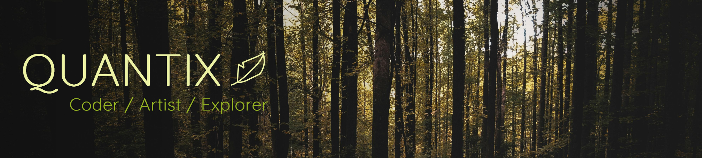

## 🚧 Currently Working on
- A discord bot that connects with the iNaturalist API

## Next on my TODO
- Something with data visualization (who knows what yet)
- Game template
- Bird song analyzer?

## 🤝 I’m looking to collaborate on...
- Hmmm...the discord bot?
- If you have any ideas, pretty much anything interesting!

## 📚 Currently Learning and Researching
- Assembly
- Logic gate compositions
- Machine Learning
